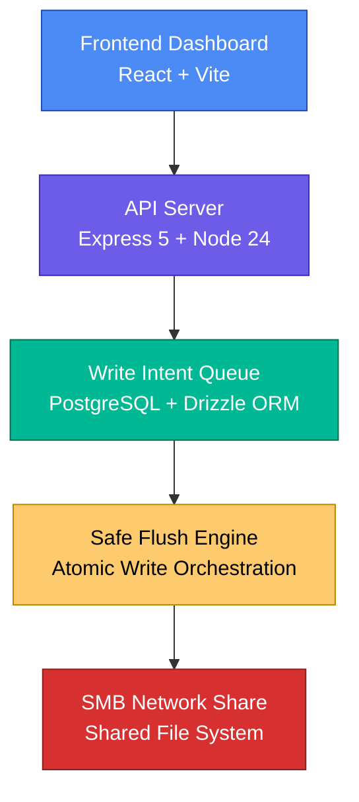
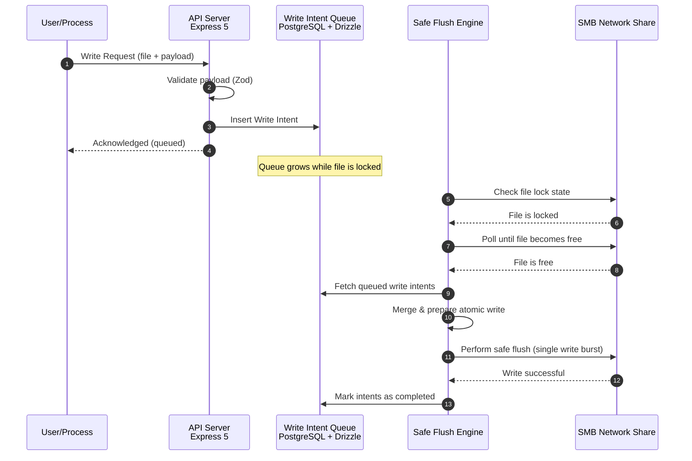
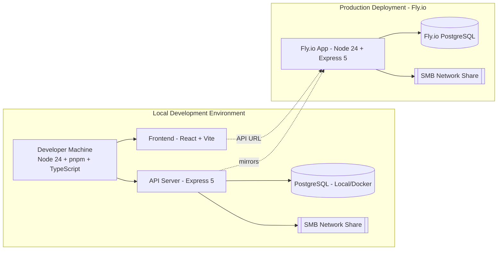
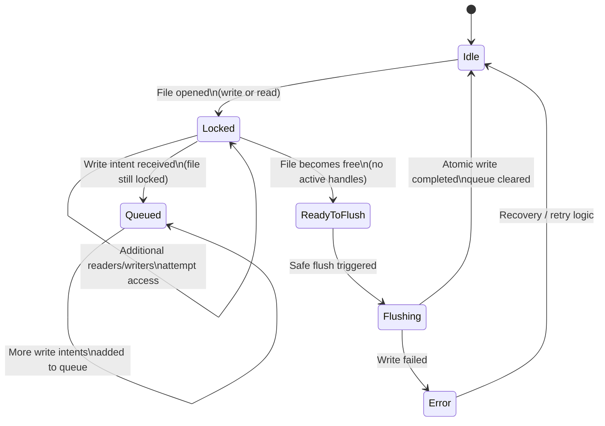

  

<h1 align="center">Network File Guard</h1>

  Concurrency‑safe monitoring and write orchestration for SMB network shares.

Network File Guard is a full‑stack monitoring and management agent designed to protect files on SMB network shares from concurrent write conflicts. When multiple users or processes attempt to update the same file, Network File Guard intelligently queues write operations and flushes them in a single, safe burst once the file becomes free — preventing data corruption, lock collisions, and partial writes.

## 📸 Dashboard Preview

> *UI preview coming soon — live monitoring, queued writes, and system health at a glance.*

## ✨ Key Features
- **Concurrency‑safe write orchestration** for SMB network shares  
- **Real‑time monitoring** of file access and lock state  
- **Write‑intent queueing** with deterministic flush behavior  
- **Full‑stack TypeScript monorepo**  
- **Structured logging** for auditability and debugging  
- **Modern frontend dashboard** for system visibility  

## 🧩 Tech Stack

### Frontend
- React + Vite  
- Tailwind CSS  
- Radix UI (shadcn/ui)  
- Wouter  
- TanStack Query (React Query)  
- Orval‑generated OpenAPI hooks  

### Backend
- Node.js 24  
- Express 5  
- PostgreSQL  
- Drizzle ORM  
- Zod (shared schemas)  
- Pino logging  

### Tooling & Architecture
- pnpm workspaces  
- TypeScript project references  
- esbuild (API)  
- Vite (frontend)  
- Docker + docker-compose  

